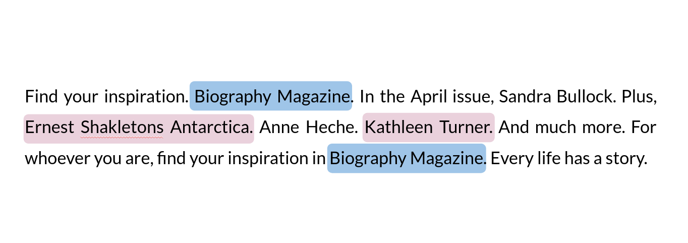

# BrandDetector
In this project, I developed a model for detecting brand names in transcribed ads using natural language processing. Digital audio advertising is a growing industry that has recently surpassed $4.5B/year, and detecting information about any given advertisement, such as the featured brand and industry, can lead to valuable insights. This is a consulting project for [Veritonic](https://www.veritonic.com), and the original training data is proprietary and therefore not available here.

## Setup
This package can be installed either locally or using Docker.

### Local setup
After cloning the repository, the package can be installed by running `pip install .` in the project root folder. If you would like to utilize your GPU for faster training and inference (highly recommended), run `pip install .[cupy]` instead.

### Docker
Instead of cloning and installing manually, you can pull and run a pre-built Docker image using:

```
docker pull bblankrot/branddetector
docker run --rm -ti bblankrot/branddetector bash
```

To use a GPU with this docker image, run `pip install cupy==7.8.0`.

## Usage

### Training
Once the package is properly set up, the model can be trained by running the script `train_script.py`:
```
python train_script.py data.json -o path/to/model -n model_name
```
The trained model will be saved to the folder `path/to/model/model_name`, and the test data (split from the original data) will be saved to `path/to/model/test_data.json`. The data file `data.json` should contain an array with at least the entries `brand` and `transcript` for each element. Sample data (adapted from Kaggle) is provided in `data/data.json`.

Training with the flag `-v` tests the model on the validation set throughout the training process, saving a model checkpoint at the end of each iteration to `path/to/model/model_name_epoch_i`, and saves a list of the accuracy achieved in each iteration to `path/to/model/model_name/history.json`. At the end of the training set, the most accurate model will be shown.

Additional flags for the training script can be seen by running `python train_script.py -h`.

### Testing
To validate the trained model, you can run the following script which takes as input the trained model and the split data, `test_data.json`:
```
python test_script.py path/to/model/model_name path/to/model/test_data.json
```
This will print the model's accuracy, and save a new file `test_data_pred.json`, containing new columns for the model's predictions and whether or not they are classified as correct.

### Inference
The function `brand_detector.predict.predict` is used to predict the brand of a string or iterable of strings, such as a list, NumPy array, or Pandas series.

```
import spacy
from brand_detector.predict import predict

nlp = spacy.load(path/to/model/model_name)
predictions = predict(nlp, transcriptions)
```

## Modeling
In order to enable detection of previously unseen brands, I employed an approach called [named-entity recognition](https://en.wikipedia.org/wiki/Named-entity_recognition) (NER). In this approach, a model is trained to locate and classify text entities that are mentioned in the data, based on either linguistic rules or statistical methods (including machine learning). For example, a typical NER task could be identifying the name, day, and place in the sentence "<ins>Abraham Lincoln</ins> was born on a <ins>Sunday</ins> near <ins>Hodgenville</ins>".

In particular, I utilized the [spaCy](https://spacy.io/) natural language processing framework, which applies a convolutional neural network in order to derive context from its training data, which is encoded using word embeddings. I introduced a custom entity type (`BRAND`) to represent brands in the data and, given labeled data, find and label all of the entities before training the spaCy NER model.

For example, this image depicts the predicted entities for a *Biography Magazine* advertisement:



We see that the model predicted the correct brand twice, along with two incorrect predictions. Nonetheless, the correct prediction is the most common.

## Results

The following accuracy results were achieved by training on 80% of Veritonic's dataset, in addition to the aforementioned data from Kaggle, and validating on 20% of the Veritonic data. Specifically, I used the training options `deapostrophe=True`, `lowercase=True`, and `n_synth=0`.

|          | Previously seen brands | Previously unseen brands | Total    |
| :------- | :--------------------: | :----------------------: | :------: |
| NER      |         **0.95**       |     **0.21**             | **0.85** |
| Baseline |         0.94           |        0.00              |  0.81    |

Using the dataset in `data/data.json` with `lowercase=False`, we achieve the following results, which are shown in detail in the Jupyter notebook  `notebooks/analysis.ipynb`:

|          | Previously seen brands | Previously unseen brands | Total    |
| :------- | :--------------------: | :----------------------: | :------: |
| NER      |         0.97           |         **0.35**         | **0.62** |
| Baseline |       **0.98**         |           0.00           |   0.43   |

Overall, the prediction accuracy here is lower, in part due to the higher incidence of unseen brands in the validation set. For these advertisements, the named-entity recognizer predicts the correct brand over a third of the time, in contrast to zero predictions by our baseline search.